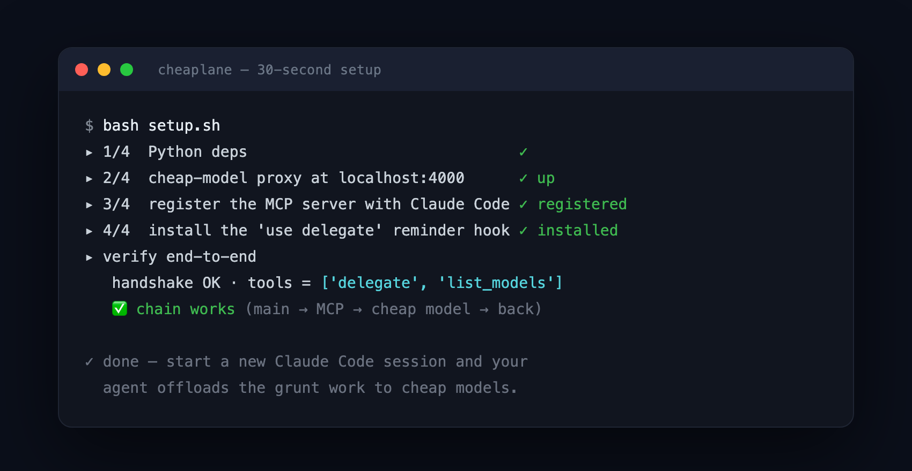

<p align="center">
  
</p>

# Cheaplane 🛣️

> **Keep your premium subscription on the main thread. Offload the grunt work to cheap models — Cheaplane even picks the right one for you. Stop burning premium tokens on boilerplate.**


Cheaplane is a tiny single-file MCP server (~250 lines, stdlib + `mcp` only) that gives your main agent — e.g. **Claude Code on a Max subscription** — one extra tool: **`delegate`**. Your agent keeps doing the thinking (planning, architecture, final review) and hands *replaceable grunt work* — boilerplate code, formatting, translation, summarizing long docs — to cheap models behind a local [LiteLLM](https://github.com/BerriAI/litellm) proxy (DeepSeek, Kimi, Qwen, …). Think of it as **a cheap intern for your premium agent** — it churns out the boring parts while you keep thinking.

The trick that makes it *safe*: **the delegated calls and your subscription live in physically separate processes and never share credentials.** ([why that matters ⬇️](#billing-isolation-the-whole-point))

The trick that makes it *effortless*: **auto-routing.** `delegate(task)` picks the right cheap model from the task itself — code → DeepSeek, long docs → Kimi, Chinese → Qwen. ([how ⬇️](#using-delegate))

The trick that makes it *stick*: **a per-turn reminder hook so your agent doesn't forget the tool exists** — [the part most "delegate" tools skip](#make-your-agent-actually-use-it). And a **savings ledger** shows you [what it kept off your quota](#see-what-you-saved).

**See it in action** — your agent hands a chore over; auto-routing sends it to the cheap code model:

```text
delegate("convert to a TypeScript interface: {id, name, email, isAdmin, roles[]}")
```

```ts
interface User {
  id: number;
  name: string;
  email: string;
  isAdmin: boolean;
  roles: string[];
}
```

<sub>↑ a real call's output — not a mockup, and no model picked by hand. That token cost **~90× less** than your premium model, and your subscription quota never moved.</sub>

## The problem

Premium models earn their price on hard problems — but every token counts against your plan, and you burn through quota on *churn*: reformatting JSON, translating UI strings, summarizing a doc you'll read once. The usual "just use a cheap model" setups force an ugly choice:

- **Downgrade the whole agent** → you lose main-thread quality on the work that actually matters.
- **Route everything through an API key** → you stop using the subscription you're already paying for.

Cheaplane keeps the sweet spot: **premium main thread for judgment + cheap models for the churn + billing that physically can't cross.**

## How Cheaplane compares

The popular 2026 move is to swap your *whole* agent onto a cheap model (DeepClaude-style). Great for raw cost — but it downgrades the thread you actually think with, **breaks your other MCP tools**, and doesn't even apply if you're on a Pro/Max subscription. Cheaplane takes the opposite bet:

| | Swap whole agent → cheap model *(DeepClaude-style)* | Everything via one API key | **Cheaplane** |
|---|:---:|:---:|:---:|
| Main thread | ⬇️ downgraded | ⬇️ no more subscription | ✅ stays premium |
| Your other MCP tools | ❌ break | ✅ | ✅ *(it **is** an MCP server)* |
| Works on a Pro/Max subscription | ❌ API-key only | ❌ replaces it | ✅ built for it |
| Picks the cheap model for you | ❌ one model for everything | ❌ | ✅ `auto` routing |
| Shows what you saved | ❌ | ❌ | ✅ `savings` ledger |
| Billing | merged into one | one per-token bill | 🔒 subscription + cheap, **isolated** |

<sub>Comparison reflects how backend-swap setups (DeepClaude-style) behaved per public reports in mid-2026; specifics vary by tool and can change.</sub>

## How cheap is "cheap"?

The grunt work is the *easy* part — paying premium rates for it is pure waste. Per **million tokens** (public list prices, mid-2026):

| Model | Input | Output | Best for |
|---|--:|--:|---|
| Claude Opus *(API, for reference)* | $5.00 | **$25.00** | the judgment work you keep |
| DeepSeek V4 Flash | $0.14 | **$0.28** | code / formatting |
| Kimi K2 | $0.60–0.95 | $2.50–4.00 | long docs (very large context) |
| Qwen | $0.05–0.40 | $0.20–1.20 | Chinese copy |

That's an output token costing **~$25 on Opus vs ~$0.28 on DeepSeek — about 90× more for work that doesn't need the smarts.** You're on a *subscription*, so you don't pay that $25 directly — your main thread spends *quota*, not dollars. That's the whole point: every routine task you offload is premium quota you keep for the hard problems. *(Summarizing a 40-page doc on DeepSeek Flash runs ~$0.005 — your quota never even notices.)*

<sub>Prices are public list rates, mid-2026, and vary by tier/caching — check each provider. The stable takeaway is the order-of-magnitude gap, not an exact dollar saving.</sub>

## Billing isolation (the whole point)

Most "save money" hacks blur your bills together. Cheaplane keeps them physically apart:


The Cheaplane process **never imports your subscription provider's SDK, never reads its auth, never touches its OAuth token.** It knows exactly one thing: an HTTP endpoint (your proxy) and its key. Your main thread bills to your subscription; delegated calls bill to your cheap proxy. **The two can't cross — not by policy, by architecture.**

## Quick start

**Fastest path** — Claude Code, one script:

```bash
git clone https://github.com/arggjarvs/cheaplane && cd cheaplane
cp litellm.yaml.example litellm.yaml          # then: export DEEPSEEK_API_KEY=sk-...
litellm --config litellm.yaml &               # start the cheap-model proxy on :4000
bash setup.sh                                 # deps + register MCP + reminder hook + verify
```

`setup.sh` is idempotent (safe to re-run): it installs deps, registers the `delegate` MCP server with Claude Code, installs the per-turn reminder hook, and verifies the chain end-to-end. Then start a fresh Claude Code session — done.

<p align="center"></p>

<details>
<summary><b>Manual setup / what <code>setup.sh</code> does under the hood</b></summary>

<br>

**1. Get an OpenAI-compatible endpoint for the cheap models.** Most people run [LiteLLM](https://github.com/BerriAI/litellm) locally as a proxy in front of DeepSeek / Kimi / Qwen. A minimal config is ~5 lines:

```yaml
# litellm.yaml — exposes DeepSeek under the model_name "deepseek"
model_list:
  - model_name: deepseek
    litellm_params:
      model: deepseek/deepseek-chat        # swap for any provider/model LiteLLM supports
      api_key: os.environ/DEEPSEEK_API_KEY
```

```bash
pip install 'litellm[proxy]'
litellm --config litellm.yaml        # serves http://localhost:4000
```

That `model_name: deepseek` lines up with Cheaplane's default alias, so it works out of the box. (`deepseek` is a built-in LiteLLM provider — no `api_base` needed; you'd add one only for a custom or self-hosted endpoint.) Already have an OpenAI-compatible endpoint (LiteLLM, OpenRouter, Ollama, vLLM…)? Skip this and just point `DELEGATE_BASE_URL` at it.

**2. Install Cheaplane:**

```bash
git clone https://github.com/arggjarvs/cheaplane && cd cheaplane
uv sync     # or:  python -m venv .venv && .venv/bin/pip install mcp
```

**3. Register it with your MCP client** — copy `.mcp.json.example` to `.mcp.json` in the repo root and fix the path (or use `claude mcp add`):

```json
{
  "mcpServers": {
    "delegate": {
      "command": "uv",
      "args": ["run", "--directory", "/ABSOLUTE/PATH/TO/cheaplane", "python", "server.py"]
    }
  }
}
```

**4. Verify it end-to-end** — with your proxy from step 1 running (handshake → list tools → a real delegated call):

```bash
uv run python probe.py
# ✅ chain works (main → MCP → cheap model → back)
```

</details>

## Using `delegate`

Your agent now has `delegate(task)` — **routing is automatic**; override only when you want to:

```text
delegate("convert this JSON to a TypeScript interface: …")      #  auto → deepseek (code)
delegate("summarize this 40-page contract: …")                  #  auto → kimi (very long input)
delegate("…Chinese text in the task auto-routes here…")        #  auto → qwen (Chinese copy)
delegate("translate these UI strings to Japanese", "flash")     #  explicit alias still wins
```

| alias | good for |
|---|---|
| `auto` | **default** — picks one of the below from the task itself |
| `deepseek` | code / balanced |
| `mimo` | reasoning / multi-step |
| `flash` | fast / formatting / translation |
| `kimi` | long documents (very large context) |
| `qwen` | Chinese copywriting |

Aliases map to your LiteLLM `model_name`s. Point them at your proxy **without editing code** — set the `DELEGATE_MODEL_MAP` env var (a JSON object), or drop a `~/.claude/delegate-model-map.json` (hot-reloaded — no restart needed); editing `MODEL_ALIASES` in `server.py` also works.

<details>
<summary><b>What to delegate vs keep (rule of thumb)</b></summary>

<br>

**Delegate** (let the cheap model do it):
- boilerplate / scaffolding from a clear spec
- mechanical refactors, formatting, lint fixes
- translation; summarizing or extracting facts from long docs
- routine prose: changelogs, docstrings, commit messages

**Keep** (you do it yourself):
- planning, architecture, technical trade-offs
- **final review of delegated output — always you**
- talking to the user; judgment calls
- anything where being subtly wrong is expensive

The delegated model sees **only your `task` string** — it has no access to your conversation. Make each task self-contained: spec + the actual input + the exact output format you want.

</details>

## See what you saved

Every delegated call appends one line of **metadata only — never the task content** — to `~/.cheaplane/usage.jsonl`. Ask your agent for `savings` any time (sample output):

```text
Cheaplane savings — all time
  delegated calls : 184
  tokens offloaded: ~412,300 in / ~365,800 out
  premium cost avoided (Opus list): ~$11.21
  actually spent (DeepSeek-class) : ~$0.16  (≈70× cheaper, in+out blended)
  last 7 days     : 31 calls, ~$2.04 avoided
```

Numbers are estimates at public list prices — the real win is the premium **quota** that never left your subscription. The ledger records token counts and model names only; delete the file any time, or set `DELEGATE_NO_LOG=1` to turn logging off entirely.

## Make your agent actually use it

Here's the dirty secret of every "delegate to a cheap model" tool: **installing it isn't the hard part — getting your agent to actually *use* it is.** Drop a tool into an agent and, a few turns into a real task, it forgets the tool exists and grinds through the grunt work itself on premium tokens. The instruction sinks down the context; attention moves on.

Cheaplane ships the fix in the box — three layers you can stack:

1. **Skill** (`SKILL.md`) — teaches the agent *when* to delegate. Works on any client; passive, so treat it as the baseline.
2. **A one-line default** in your `CLAUDE.md` / system prompt: *"Before doing replaceable grunt work yourself, delegate it."* Stronger — but a static instruction still drifts down a long conversation.
3. **A per-turn reminder hook** — the reliable one (Claude Code). It re-injects the nudge on **every** prompt, so the habit never sinks out of view. This is what turns an *installed* tool into a *used* one.

**On other MCP clients** (no `UserPromptSubmit` hook system), use layers 1–2 — wire the one-liner into whatever system prompt your client supports.

Install the hook — safe and idempotent (backs up your settings, **merges** instead of overwriting, de-dupes on re-run):

```bash
bash install-hook.sh            # registers hooks/delegate-reminder.sh as a UserPromptSubmit hook
# verify it's wired up:
python3 -c "import json,os;s=json.load(open(os.path.expanduser('~/.claude/settings.json')));print([h['command'] for e in s.get('hooks',{}).get('UserPromptSubmit',[]) for h in e.get('hooks',[])])"
```

Start a fresh session, and your agent self-checks every turn: *"is this replaceable grunt work? → delegate it."*

<sub>The reminder costs ~60 tokens per turn — trivially less than the hundreds of premium tokens a single forgotten delegation burns. The hook uses Claude Code's <code>UserPromptSubmit</code> mechanism.</sub>

## Config

| Env var | Default | Meaning |
|---|---|---|
| `DELEGATE_BASE_URL` | `http://localhost:4000` | OpenAI-compatible endpoint (your proxy) |
| `DELEGATE_API_KEY` | `sk-litellm` | key for that endpoint |
| `DELEGATE_TIMEOUT` | `120` | per-call timeout (seconds) |
| `DELEGATE_MODEL_MAP` | *(none)* | JSON remapping aliases, e.g. `{"deepseek":"deepseek-v4-flash"}` — overrides defaults, no code edit |
| `DELEGATE_LOG` | `~/.cheaplane/usage.jsonl` | where the savings ledger lives |
| `DELEGATE_NO_LOG` | *(unset)* | set to `1` to disable the ledger entirely |

## FAQ

**Will this leak my subscription credentials?**
No. The `delegate` tool runs in its own process and only ever makes a plain HTTP call to the endpoint *you* configure. It never imports your subscription SDK and never sees its auth — see [Billing isolation](#billing-isolation-the-whole-point).

**What exactly does the savings ledger record?**
One JSON line per call: timestamp, alias, model name, and token/character counts. **Never the task text, never the model's output.** Delete `~/.cheaplane/usage.jsonl` any time, or set `DELEGATE_NO_LOG=1`.

**How does `auto` decide which model to use?**
A small deterministic heuristic in `server.py` (`_pick_model`, ~20 lines you can read and tweak): code signals → `deepseek`, very long input → `kimi`, Chinese-heavy → `qwen`, multi-step language → `mimo`, short mechanical chores → `flash`. An explicit alias always overrides it.

**How is this different from just using one API key for everything?**
With a single API key you stop using your subscription entirely and pay per token for *all* work — including the hard parts. Cheaplane keeps your subscription as the premium main thread and sends only the cheap, replaceable churn elsewhere.

**Does it work with anything besides Claude Code?**
Yes — any MCP-compatible client (Cursor, Cline, Windsurf, …). The main agent just needs to support MCP tools; see Manual setup for the generic JSON config.

**Do I have to use DeepSeek / Kimi / Qwen?**
No. Anything reachable through an OpenAI-compatible endpoint works; the aliases are just convenience labels you can remap with `DELEGATE_MODEL_MAP`.

**Why a proxy instead of calling providers directly?**
One endpoint, one key, usage logging, and easy model swaps — and it keeps provider keys out of the MCP server entirely.

## Roadmap & ideas (help wanted)

Cheaplane's core stays deliberately tiny — but the surface it opens up is big. Shipped so far: ✅ auto-routing (v0.2), ✅ savings ledger (v0.2). Still worth building — proposals and PRs welcome, and most are small enough to be good first issues:

- **Smarter routing** — the current router is a readable heuristic; better signals (or a learned router) are an open playground.
- **Richer savings dashboard** — the ledger is plain JSONL; a `cheaplane stats` HTML view would be lovely.
- **Result cache** — skip re-delegating identical tasks.
- **Auto-review** — lint/test code that comes back before you trust it.
- **Batch / parallel delegate** — hand off several chores in one call.
- **More client adoption recipes** — the reminder hook targets Claude Code's `UserPromptSubmit`; Cursor / Cline / others want their own nudge.

> Design rule: **keep the core single-file and dependency-light — that's the whole point.** Build extensions as opt-in, so the 5-minute read stays a 5-minute read.

## Contributing

Issues and PRs welcome — it's ~250 lines of single-file Python with no heavy deps, easy to hack on. Add a useful model alias, a routing signal, or a client recipe and send it over.

## License

MIT — see [LICENSE](LICENSE).
